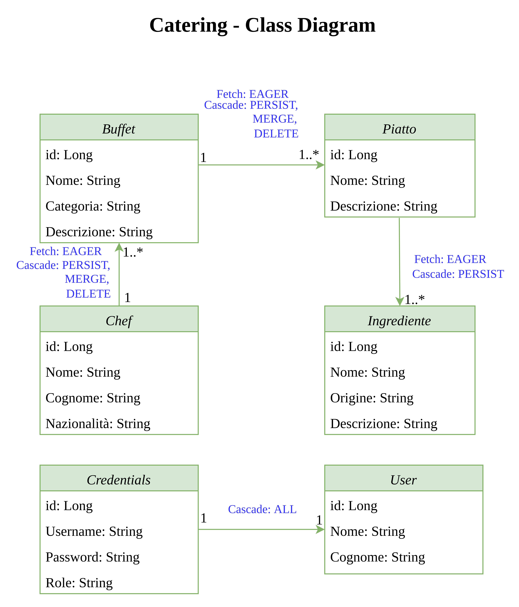

# SIW-Catering-2022

Repository of the Exam project for the realisation of a Spring Boot Application that manages a _Catering Service_.

## Class Diagram

## Technologies Used
- HTML
- CSS
- Java
- Maven
- Spring Boot
- Heroku

## The app deployed

[See the deployed app here!](https://siw-catering-2022.herokuapp.com/)

## Use cases

### Admin use cases
- insert a new Chef
- insert a new Ingredient
- show all chefs, remove and edit a Chef
- show all Buffets
- show all Dishes
- show all Ingredients
- show all Registered Users

### User use cases
- explore the selection by Chefs
  - Buffets of the chef
    - Dishes of the buffet
      - Ingredients of a dish
- explore the selection by Buffets
  - Dishes of the buffet
    - Ingredients of the dish
